<div align="center">

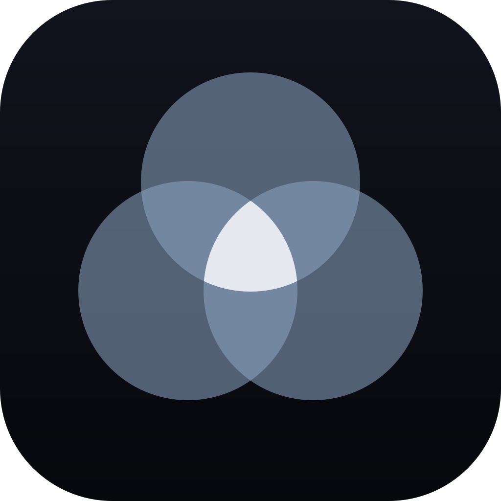

# Tutti

**Un orquestador para trabajar con varios agentes de programación a la vez.**

Claude Code, OpenCode, Gemini CLI, Codex, Antigravity y cualquier otro, cada uno en su terminal,<br />
con editor, git, servidores MCP y consumo de tokens en la misma ventana.

[](https://github.com/cyansaju-sys/orches/releases/latest)


[Instalar](#instalar) · [Qué incluye](#qué-incluye) · [Atajos](#atajos) · [Desarrollo](#desarrollo) · [Privacidad](#privacidad)

<br />

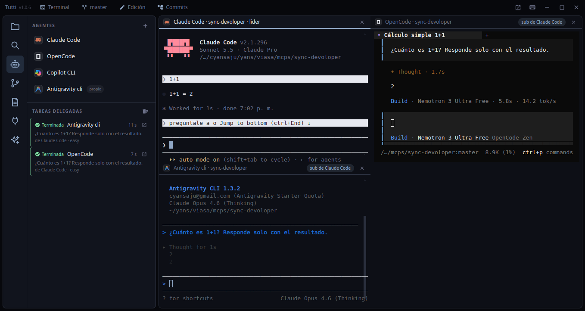

<sub>Ejemplo real: un Claude Code (el líder) reparte una tarea a OpenCode y a Antigravity; cada uno se abre en su propio editor, marcado «sub de …», y el apartado de tareas delegadas muestra su estado, modelo y duración.</sub>

</div>

<br />

## Instalar

<table>
<tr>
<td width="50%" valign="top">

### Linux

```bash
curl -fsSL https://github.com/cyansaju-sys/orches/releases/latest/download/install.sh | bash
```

Descarga el AppImage de la última release en `~/.local/share/tutti/`, crea el comando `tutti` y la entrada del menú de
aplicaciones. No hace falta ser administrador. Si falta `libfuse2` (Arch: `fuse2`) funciona igual, solo que abre más despacio.

Para quitarla: `install.sh --uninstall` (tus ajustes en `~/.config/tutti` se conservan).

</td>
<td width="50%" valign="top">

### Windows

Descarga **`Tutti-Setup-X.Y.Z.exe`** de la [última release](https://github.com/cyansaju-sys/orches/releases/latest) y ábrelo.
Se instala para tu usuario, sin permisos de administrador, y crea el acceso directo.

> El instalador no está firmado: Windows puede mostrar el aviso de SmartScreen. Pulsa
> **Más información → Ejecutar de todas formas**.

</td>
</tr>
</table>

**Se actualiza sola.** Cuando sale una release nueva aparece un botón **Actualizar a vX.Y.Z** arriba a la derecha. Al pulsarlo
descarga la versión nueva, verifica su hash y la app se reinicia para aplicarla.

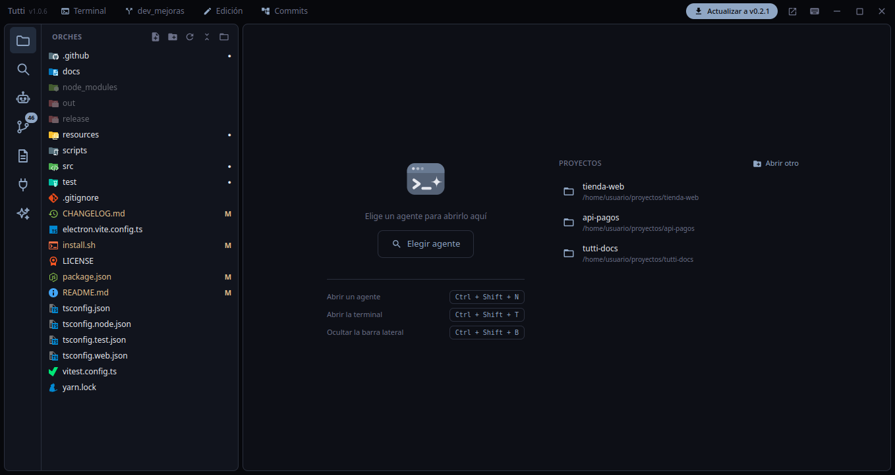

**Y te cuenta qué cambió.** La primera vez que abres la app tras actualizar sale un diálogo con las **novedades** de la versión (o de
todas las que te saltaste). Salen de [CHANGELOG.md](CHANGELOG.md) y puedes volver a verlas pulsando el número de versión junto al
nombre de la app.

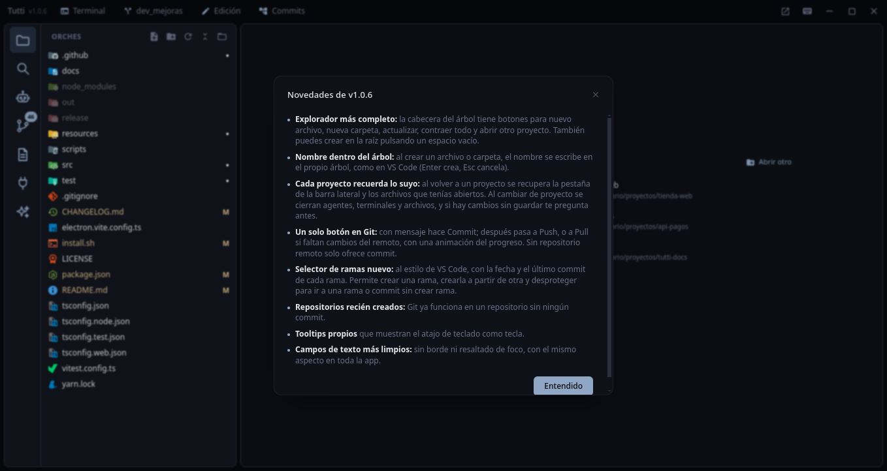

> macOS llegará más adelante. El código de la versión anterior (Python) sigue en los tags `v0.1.x`.

<br />

## Qué incluye

### Archivos y editor

Árbol con los íconos de Material Icon Theme y la letra de git en lo que cambió. Los archivos se abren en pestañas, ya editables,
con colores, marcas de git en el margen (verde añadido, azul modificado, rojo borrado), autocompletado (`Enter` o `Tab` aceptan),
`Ctrl+S` para guardar y recarga automática si otra herramienta cambia el archivo. El permiso **Edición** de la barra de título
(o `Ctrl+Shift+L`) los deja en solo lectura. Con el árbol enfocado se navega con las flechas.

La cabecera del árbol tiene los botones **Nuevo archivo**, **Nueva carpeta**, **Actualizar**, **Contraer todo** y **Abrir otro
proyecto**; también puedes pulsar en un espacio vacío del árbol para crear algo en la raíz. El nombre se escribe en el propio
árbol, como en VS Code (`Enter` crea, `Esc` cancela).

**Cada proyecto recuerda lo suyo.** Al cambiar de proyecto se cierran sus agentes, terminales y archivos (si hay cambios sin
guardar, antes pregunta), y al volver a uno ya conocido se recupera la pestaña de la barra lateral y los archivos que tenías
abiertos. Los **tooltips** son propios y muestran el atajo de teclado como tecla.

Con **clic derecho** sobre un archivo o carpeta:

| Acción | Qué hace |
|---|---|
| **Enviar al agente** | Escribe la ruta (`@ruta` en los agentes que la entienden) en el prompt del agente activo, sin pulsar Enter |
| **Nuevo archivo / Nueva carpeta** | Los crea dentro de la carpeta con el campo de nombre en el árbol; el archivo se abre en el editor |
| **Renombrar** | Las pestañas abiertas siguen el cambio de nombre |
| **Copiar ruta / ruta relativa** | Al portapapeles, sin avisos |
| **Borrar** | Pide confirmación y lo manda a la **papelera** (se puede recuperar) |

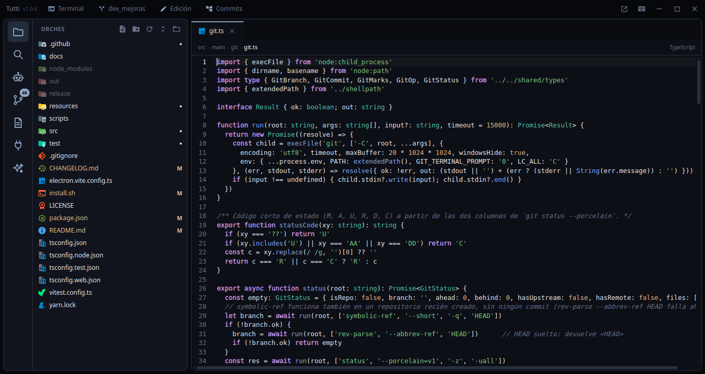

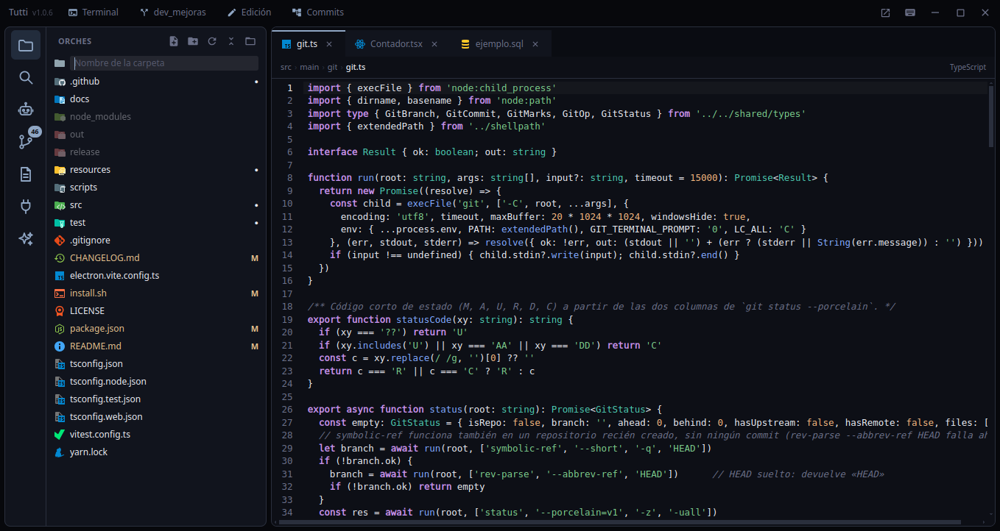

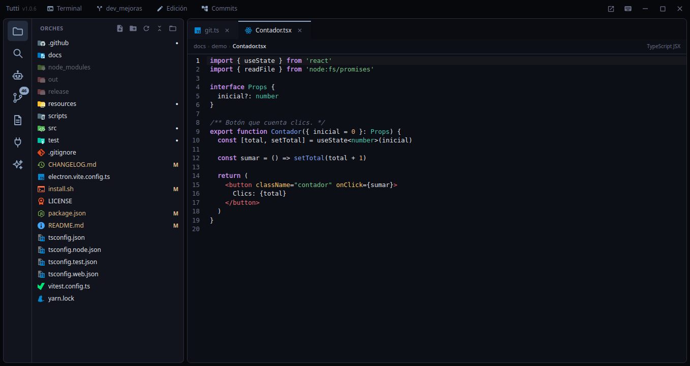

#### Buscar y reemplazar

- **En el archivo abierto:** `Ctrl+F` abre un cuadro flotante arriba a la derecha del editor, con *distinguir mayúsculas*, *palabra
  completa* y *expresión regular*, el contador («3 de 12») y los botones anterior / siguiente. `Ctrl+H` añade la fila de reemplazo
  (*Reemplazar* y *Todo*). `Enter` / `Shift+Enter` recorren las coincidencias y `Esc` cierra.
- **En todo el proyecto:** el apartado **Buscar** de la barra lateral (`Ctrl+Shift+F`) agrupa los resultados por archivo y al pulsar
  uno se abre en esa línea, con la coincidencia seleccionada. *Filtros* admite globs separados por comas para incluir y excluir
  (`*.ts, src/**` · `*.test.ts, docs/`). Respeta el `.gitignore` si el proyecto usa git y salta binarios y archivos de más de 1 MB.
  Se corta a las 5000 coincidencias o 500 archivos (el contador muestra «+»).
- **Reemplazar en el proyecto:** `Ctrl+Shift+H` (o la flecha a la izquierda del campo) despliega el campo de reemplazo; se puede
  reemplazar por archivo o todo a la vez, pidiendo confirmación. Con expresión regular admite `$1`, `$&` y `$$`; conserva los fines
  de línea y **salta los archivos abiertos con cambios sin guardar** para no pisarlos.

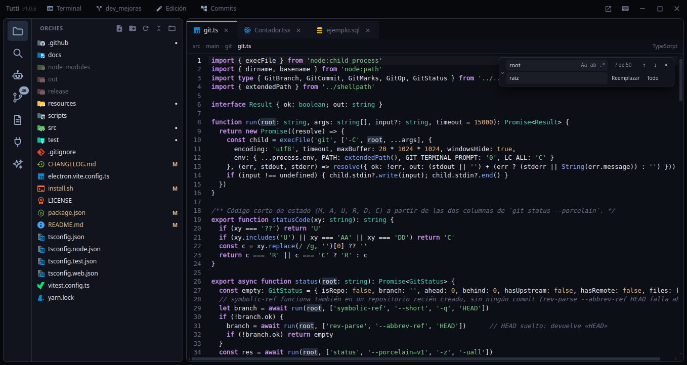

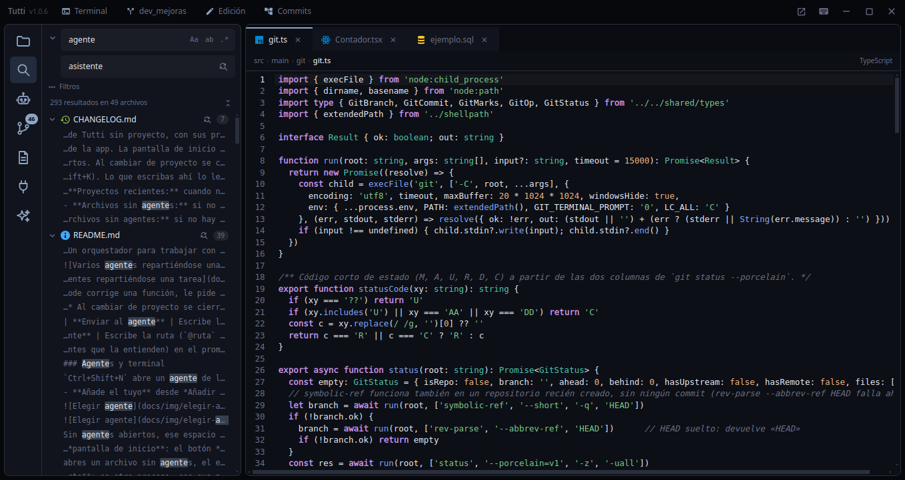

### Agentes y terminal

`Ctrl+Shift+N` abre un agente de los instalados. Se buscan en el `PATH`, en el de tu shell de login y en las carpetas habituales,
así que funciona aunque lances la app desde el menú. `Ctrl+Shift+T` abre una shell en el proyecto como sección aparte, con varias terminales en una lista a la derecha.

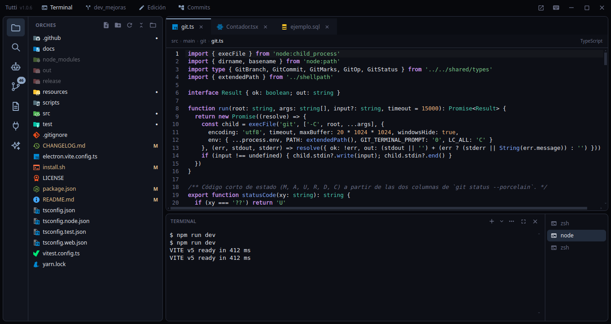

- **Detecta los más habituales** —Claude Code, OpenCode, Codex, Gemini CLI, Aider, Cursor, Goose, Amp, Qwen Code, Copilot CLI,
  Droid, Kimi, Crush, Kilo, Cline, Plandex, Auggie, Forge, Mistral Vibe, Warp— con su logo.
- **Añade el tuyo** desde *Añadir otro agente…* (por ejemplo **Antigravity**, con el comando `agy`): escribes el comando (con
  argumentos si hace falta) o eliges uno de los ejecutables que la app encuentra en tus carpetas `bin`. Los propios que no tienen
  logo llevan una insignia generada con su inicial.
- Si un proceso no arranca o termina, un aviso lo explica.

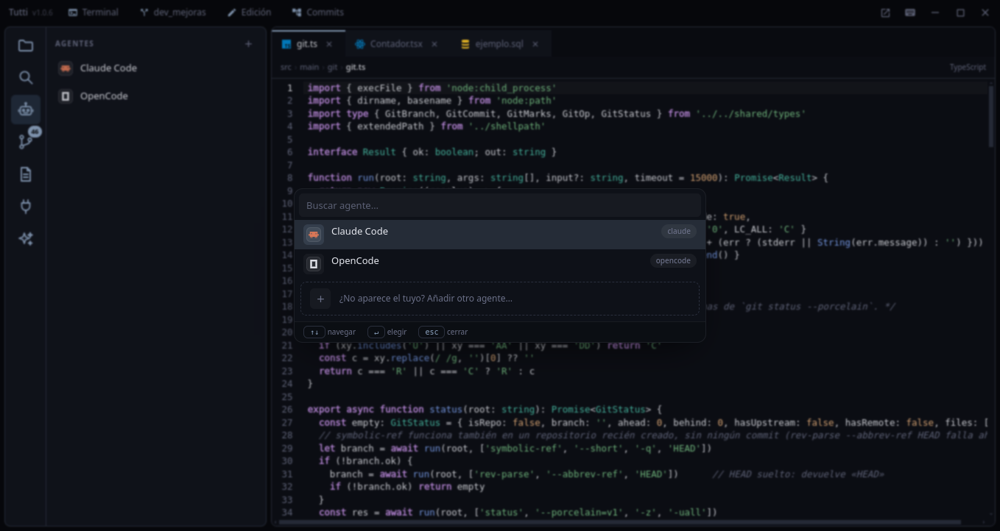

Sin agentes abiertos, ese espacio es la **pantalla de inicio**: el botón *Elegir agente*, los atajos básicos y tus **proyectos
recientes** para volver a ellos con un clic (con *Abrir otro* para elegir una carpeta y una ✕ para quitar uno del historial). Si
abres un archivo sin agentes, el editor ocupa todo el espacio. La barra lateral se pliega a solo iconos con `Ctrl+Shift+B`, y con
doble clic en un icono.

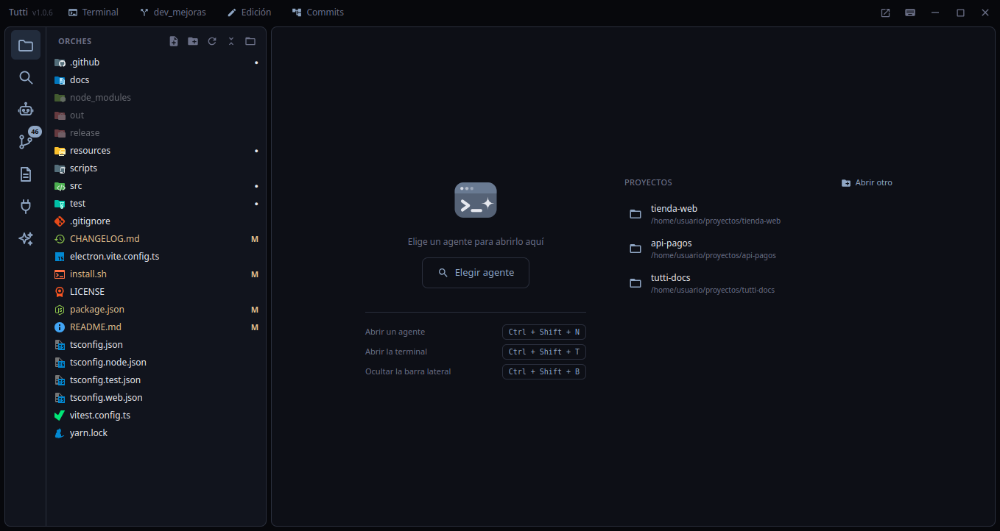

**Tema claro y oscuro.** La tuerca de abajo en la barra lateral abre los ajustes: *Tema oscuro*, *Tema claro* o *Automático*, que sigue al del sistema. El tema elegido se recuerda y cambia también el editor, los colores del código y las terminales.

**Varias ventanas.** El botón de la barra de título (o *Nueva ventana vacía* en el menú del lanzador, con clic derecho sobre el
icono en Linux) abre otra ventana de Tutti **sin proyecto**: es otro proceso, con sus propios agentes, su servidor de tareas y su
proyecto. Los ajustes (`settings.json`) se comparten, así que lo último que abras en cualquier ventana es lo que se reabre al iniciar.

### Reparto de tareas

La app abre un servidor MCP local (solo `127.0.0.1`, con un token distinto en cada ejecución) y conecta a cada agente a él con las
herramientas `list_agents`, `delegate_task`, `wait_agent` y `read_agent_output`. Un agente puede mandar una tarea a otro abierto o
pedir uno nuevo —incluso del mismo tipo—, que sale en su propio editor marcado «sub de …».

**Asigna según la capacidad.** Si el agente pasa `difficulty` (`easy`, `medium`, `hard`), la app revisa la lista de agentes,
comprueba el nivel de su modelo (*basic*, *standard*, *advanced*) y su límite de uso, y elige el más adecuado: el justo para la
tarea (no gasta uno avanzado en algo fácil), libre antes que ocupado y que no tenga el límite agotado. Si el agente que se pide no
tiene capacidad suficiente, se rechaza y se propone otro (`force` lo mantiene).

Se desactiva con `"orchestration": false` en `~/.config/tutti/settings.json`. OpenCode 2.x atiende a todos sus clientes desde un
servicio compartido, así que a cada editor se le lanza con `--standalone`: su configuración no se mezcla con la de otros OpenCode.

**Antigravity** no admite configuración por proceso, así que Tutti registra en `~/.gemini/config/mcp_config.json` un servidor «tutti» (un pequeño puente que genera en `<config>/tutti/mcp-bridge.mjs`) y a cada panel le pasa por entorno la dirección y la clave de su sesión. Fuera de Tutti ese servidor no ofrece herramientas. Si Antigravity pide permiso la primera vez que usa una herramienta, apruébalo.

### Contexto del proyecto

El apartado **Contexto** (`Ctrl+Shift+K`) guarda un texto sobre el proyecto —qué es, cómo se ejecuta, convenciones— que **leen los
agentes que abras en él**: Claude Code lo recibe como parte de su prompt de sistema y OpenCode como archivo de instrucciones. Vive
**fuera del repositorio**, en `<config>/tutti/<proyecto>-<huella>/contexto.md`, y se guarda solo (o con *Guardar*). Funciona
también si el agente se abre en una subcarpeta y sin el reparto de tareas.

**Generar con IA** lo redacta un agente a partir de un resumen pequeño del proyecto (estructura, `package.json`, inicio del README,
últimos commits), sin dejarle explorar, para gastar muy pocos tokens: con Claude usa el modelo pequeño `haiku`, y si ningún agente
responde arma un borrador con reglas. Al cambiar de apartado se cancela.

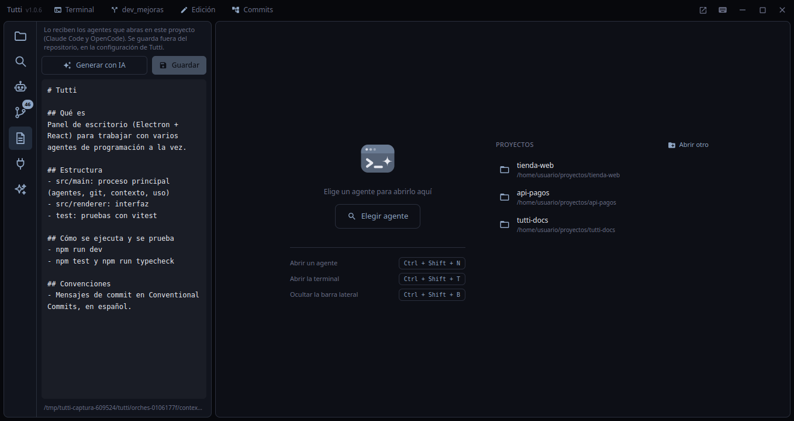

### Servidores MCP

Lee, añade y quita los servidores de **Claude Code, OpenCode, Gemini CLI, Codex y Antigravity** (globales, del proyecto y
`.mcp.json`) usando la CLI de cada agente. Los detalles ocultan los secretos hasta que lo pides y un servidor se puede copiar de un
agente a otro. Codex y Antigravity solo guardan servidores globales, y la app lo tiene en cuenta al ofrecer destinos.

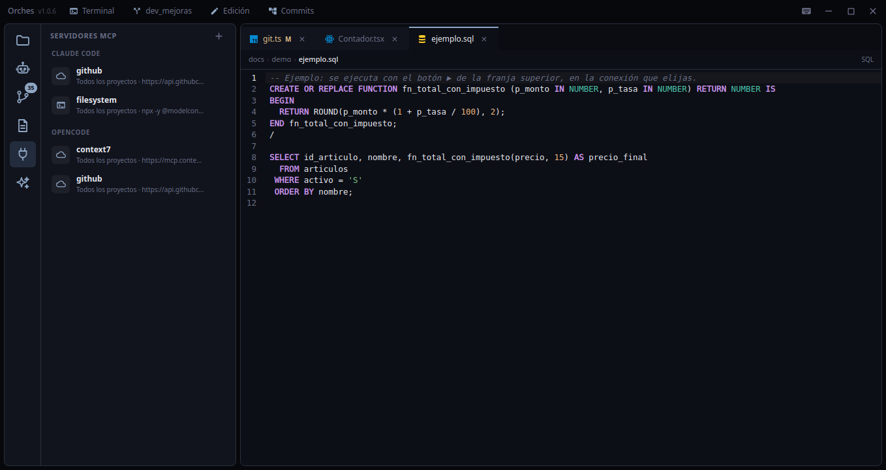

### Consumo e historial

Tokens de la ventana de 5 h de Claude, de hoy, de 7 días y totales; los porcentajes reales de límite que da Anthropic (se consultan
una vez al abrir la pestaña, con la sesión de Claude Code); el consumo de OpenCode; y el historial del proyecto, donde puedes
retomar, renombrar o borrar una sesión. De **Antigravity** se lee el historial de conversaciones (no guarda tokens en local).

### Git

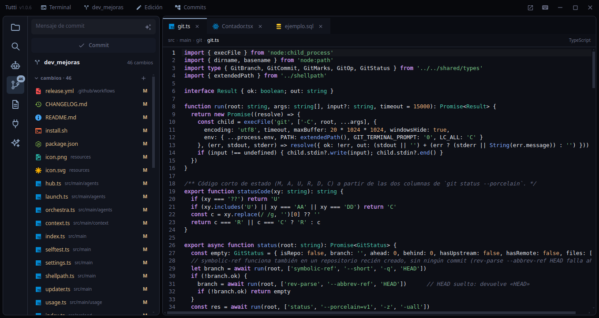

- **Cambios** con preparar / quitar, y secciones *preparados* y *cambios* que se pliegan.
- **Mensaje de commit con IA.** La ✨ del campo de commit le pide a un agente instalado un mensaje en
  [Conventional Commits](https://www.conventionalcommits.org), a partir de **lo que tienes preparado**, y lo deja en el campo para
  que lo revises. Se ve qué agente lo redacta. Si ninguno responde, se arma con reglas sencillas sobre los archivos tocados.
- **Un solo botón, un paso por pulsación.** Con mensaje hace *Commit*; después pasa a *Push* o, si faltan cambios del remoto, a
  *Pull* (solo avance simple, nunca une a ciegas), con una animación del progreso. Sin repositorio remoto solo ofrece commit.
- **Ramas** (`Ctrl+Shift+G` o el chip de la barra de título): un selector al estilo de VS Code con la fecha y el último commit de cada
  rama, búsqueda, cambio de rama, **crear** una nueva (desde la actual o *a partir de…* otra) y *desproteger* para ir a una rama o
  commit sin crear rama. Funciona también en un repositorio recién creado, sin commits.

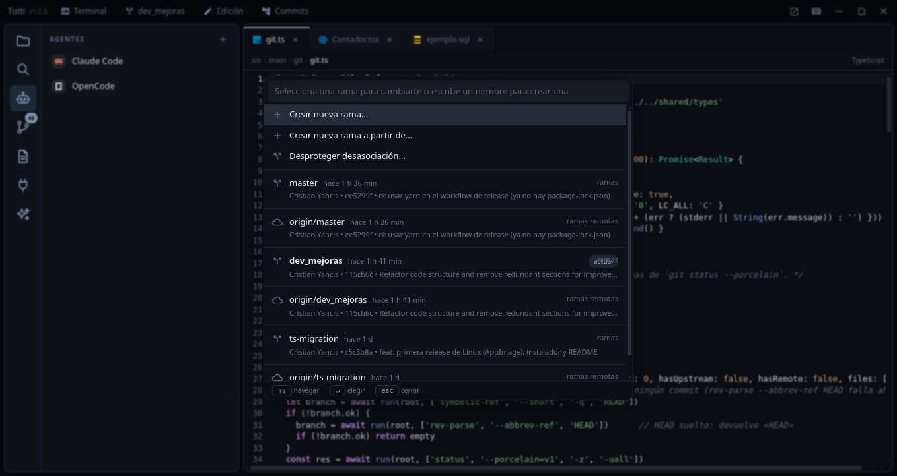

#### Comparar cambios

Al pulsar un archivo de la sección Git se abre una pestaña con la **comparación en dos columnas** (lo anterior a la izquierda, lo
nuevo a la derecha), con líneas añadidas y borradas resaltadas y los tramos largos sin cambios plegados.

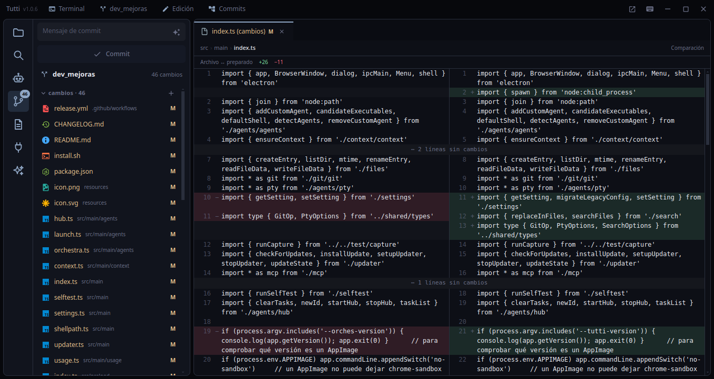

#### Commits

El chip **Commits** de la barra de título abre el **grafo de todas las ramas**, con las etiquetas de rama, remota y tag, los
merges atenuados y una fila de *cambios sin commit* que lleva a la sección Git.

- **Clic en un commit** → debajo salen sus datos y los **archivos que cambió** con `+N −N`; en un merge, lo que trajo la rama unida.
  Al pulsar un archivo se abre su comparación.
- **Clic derecho** → etiqueta, crear rama aquí, cambiar de rama (local o remota), cherry-pick, revertir, unir (con *no-ff*,
  *squash* y *no commit*), rebase, reset (suave, mixto o duro) y copiar hash o mensaje. Las operaciones que cambian el historial
  piden confirmación, y si dan conflictos se cancelan sin dejar el repositorio a medias.

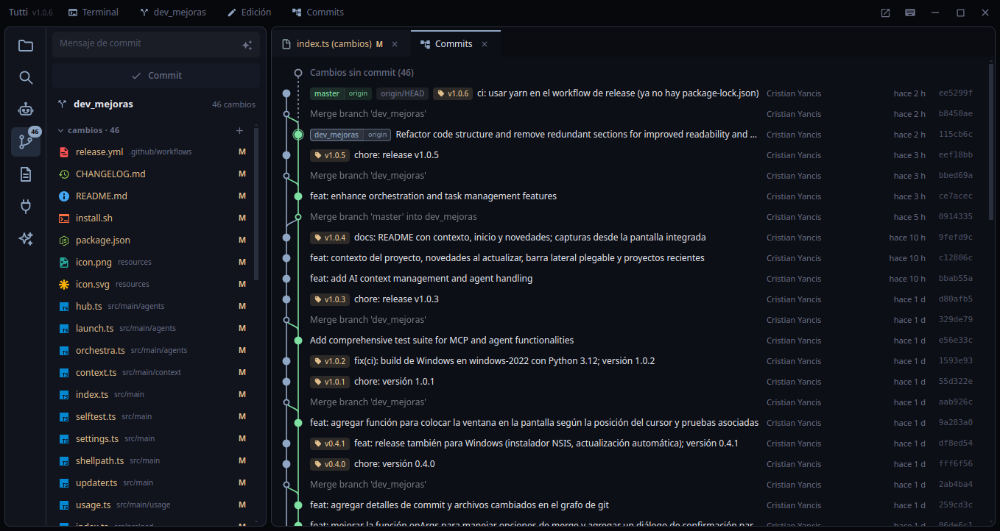

<br />

## Atajos

`F1` muestra la lista completa dentro de la app.

| Atajo | Acción |
|---|---|
| `Ctrl+S` / `Ctrl+W` | Guardar / cerrar el archivo abierto |
| `Ctrl+Shift+F` / `Ctrl+Shift+H` | Buscar / buscar y reemplazar en el proyecto |
| `Ctrl+F` / `Ctrl+H` | Buscar / reemplazar en el archivo abierto |
| `Ctrl+Shift+L` | Permitir o bloquear la edición |
| `Ctrl+Shift+N` | Abrir un agente |
| `Ctrl+Shift+T` | Mostrar u ocultar la terminal |
| `Ctrl+Shift+W` | Cerrar el editor activo |
| `Ctrl+AvPág` / `Ctrl+RePág` | Editor siguiente / anterior |
| `Ctrl+Shift+B` | Mostrar u ocultar la barra lateral |
| `Ctrl+Shift+E` · `F` · `A` · `G` · `K` · `X` · `U` | Archivos · Buscar · Agentes · Git · Contexto · MCP · Consumo |


<br />

## Desarrollo

```bash
npm install          # instala y recompila node-pty y better-sqlite3 para Electron
npm run dev          # con recarga en caliente (la interfaz se actualiza al guardar; main y preload reinician la app)
npm test             # pruebas unitarias (vitest)
npm run typecheck
npm run dist         # empaqueta el AppImage en release/
npm run dist:win     # empaqueta el instalador de Windows (hay que ejecutarlo en Windows)
```

Si tu terminal define `ELECTRON_RUN_AS_NODE` (algunos editores lo hacen), `npm run dev` ya la quita por ti.

```
src/
  main/        proceso principal
    agents/      agentes: detección, terminales (node-pty), reparto de tareas (servidor MCP) y su arranque
    git/         git y el mensaje de commit con IA
    context/     contexto del proyecto y su generación
    usage/       consumo e historial de cada agente
                 (y aquí: ventana, MCP de los agentes, archivos, ajustes, actualizador)
  preload/     el puente seguro hacia la interfaz (window.api)
  renderer/    interfaz en React + Tailwind (componentes, vistas, estado con zustand)
  shared/      tipos compartidos
test/          pruebas (vitest) en test/main y test/renderer, y capture.ts, el modo de capturas
resources/     ícono de la app
scripts/       dev.mjs
```

<details>
<summary><b>Herramientas de depuración</b></summary>

<br />

Todas por variable de entorno:

| Variable | Qué hace |
|---|---|
| `TUTTI_MCP_LOG=1` | Imprime cada petición que reciben los servidores MCP |
| `TUTTI_CAPTURE=<carpeta>` | Abre la app con ajustes aislados, recorre las pantallas y guarda una captura de cada una (así se hicieron las de este README) |
| `TUTTI_CAPTURE_NEW=1` | Con la captura, añade el inicio sin agentes, el contexto del proyecto y las novedades |
| `TUTTI_CAPTURE_GRAPH=1` · `TUTTI_CAPTURE_DIFF=<archivo>` | Con la captura, añade el grafo de commits y la comparación de un archivo modificado |
| `TUTTI_CAPTURE_REAL=1` | Con la captura, lanza **agentes reales** (Claude Code) en una carpeta de ejemplo temporal para la imagen principal; gasta tokens de tu cuenta |
| `TUTTI_SELFTEST=1` | Prueba el reparto de tareas de punta a punta con agentes falsos |

</details>

<details>
<summary><b>Publicar una release</b></summary>

<br />

1. Sube `version` en `package.json` (p. ej. `1.0.2`), añade su sección `## 1.0.2` a `CHANGELOG.md` (lo que verán los usuarios) y haz commit.
2. `git tag v1.0.2 && git push origin master v1.0.2`.

GitHub Actions comprueba que el tag coincide con la versión y que el changelog la menciona, pasa tipos y pruebas, empaqueta el AppImage (Linux) y el instalador
(Windows) y crea la release con `Tutti-X.Y.Z-x86_64.AppImage`, `latest-linux.yml`, `install.sh`, `Tutti-Setup-X.Y.Z.exe` y
`latest.yml` (lo que lee el actualizador). Si el build de Windows falla, la de Linux sale igual. Las instalaciones existentes ven el
botón **Actualizar** al cabo de unos minutos.

</details>

<br />

## Privacidad

Solo lectura sobre los datos de los agentes: los registros de Claude Code (`~/.claude/projects`), su configuración MCP
(`~/.claude.json`), la base de OpenCode (`~/.local/share/opencode`) y el historial de Antigravity (`~/.gemini/antigravity-cli`).

La app solo sale a internet para consultar tus límites en Anthropic (con la sesión de Claude Code) y para buscar actualizaciones en
GitHub. El servidor de reparto de tareas escucha únicamente en `127.0.0.1`.

<div align="center">

<br />

<sub>Hecho con Electron, React, TypeScript y Tailwind · MIT</sub>

</div>
