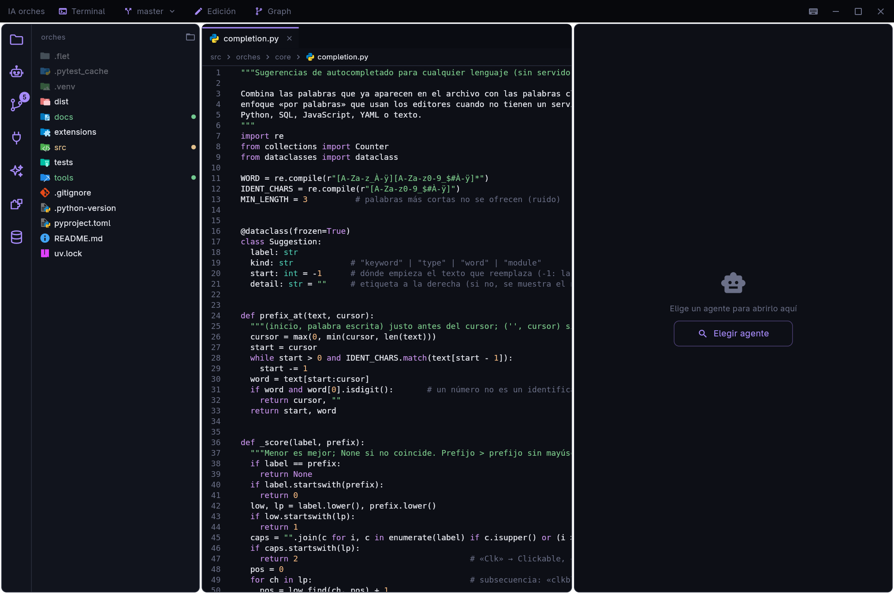
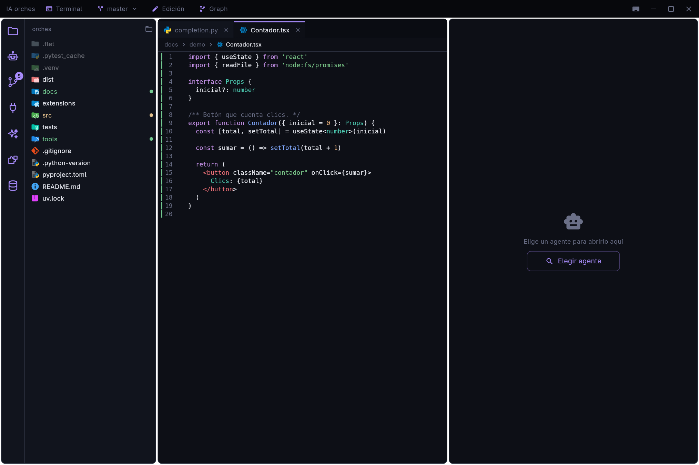
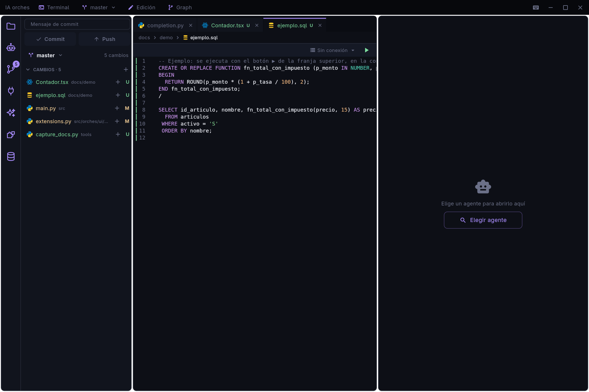
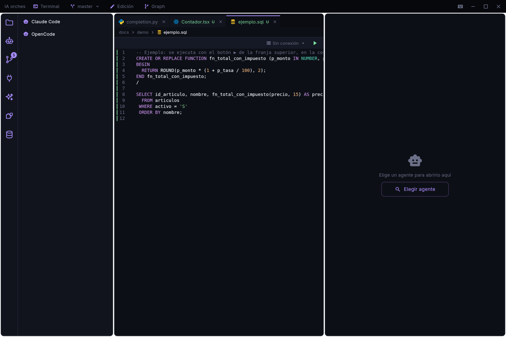
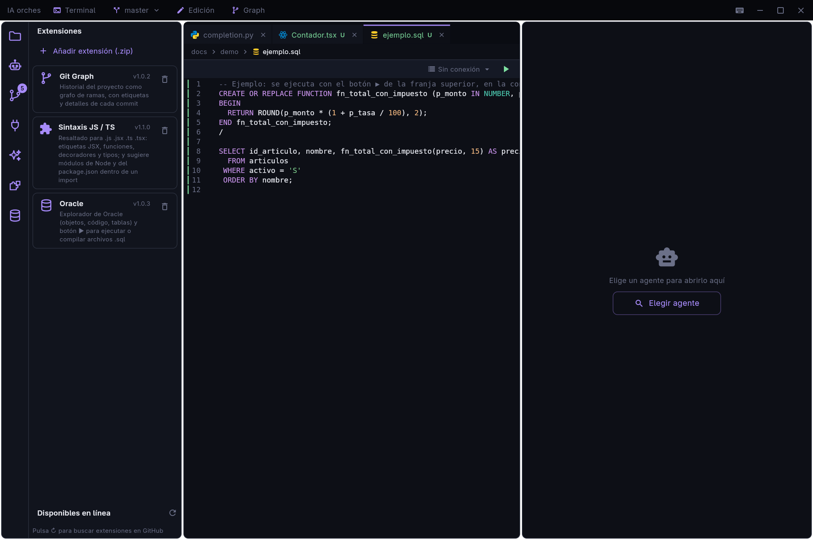
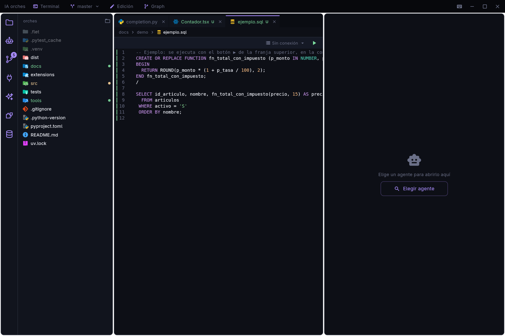
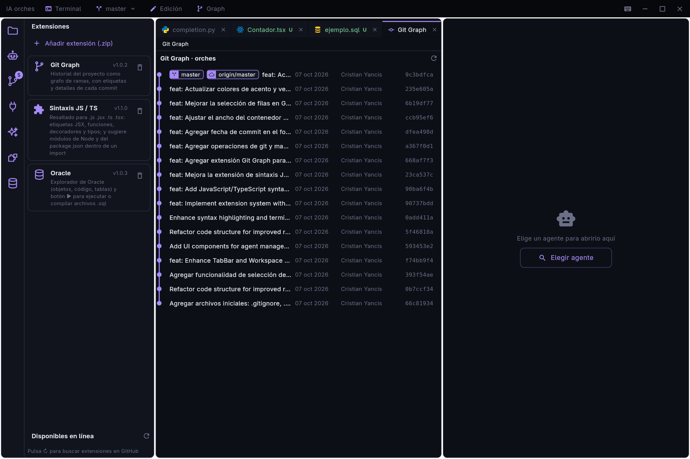

# Orches

Panel de escritorio (Flet) para trabajar con varios agentes de programación a la vez —Claude Code,
OpenCode y otros— en terminales embebidas, con explorador de archivos, editor, git, consumo de tokens e
historial de sesiones. Si hay más de un agente, el primero (el líder) puede repartir tareas a los
demás según su modelo. Se amplía con [extensiones](docs/EXTENSIONES.md).



## Instalar

**Linux** — un comando, sin permisos de administrador:

```bash
curl -fsSL https://raw.githubusercontent.com/cyansaju-sys/orches/master/install.sh | bash
```

Si la release trae el **binario** (Linux x86_64) lo instala tal cual: no hace falta Python, `uv` ni `git`. Si no, instala
desde el código con `uv` (descarga Python y las dependencias; instala `uv` si falta, preguntando antes). En ambos casos
crea el comando `orches` (en `~/.local/bin`) y la entrada del menú de aplicaciones.

El mismo comando **actualiza** a la última versión publicada. Opciones: `./install.sh --ref v0.1.1` (una versión
concreta), `--source` (forzar la instalación desde el código) y `--uninstall` (lo quita; tus ajustes en
`~/.config/orches` se conservan).

**Windows** — descarga `Orches-vX.Y.Z-windows.zip` de la [página de releases](https://github.com/cyansaju-sys/orches/releases),
descomprímelo y ejecuta `Orches.exe` (sin instalar Python). Los ejecutables los compila GitHub Actions al subir un tag `v*`
([release.yml](.github/workflows/release.yml)); el de Windows no se puede compilar desde Linux.

**macOS** — por ahora, desde el código (abajo).

## Ejecutar desde el código

```bash
uv sync
uv run poe dev            # flet run -r src/main.py  (recarga al guardar)
uv run poe test           # pytest
```

Windows, macOS y Linux. En Windows se usa `pywinpty` (se instala solo); no hace falta `zenity` ni
nada del sistema.

## Recorrido

### Archivos y editor

El árbol de la izquierda muestra el proyecto con el ícono de cada tipo de archivo y la letra de git en lo que
cambió (`M` modificado, `U` nuevo; las carpetas llevan un punto). Los archivos se abren como en VS Code: en
**pestañas** junto a los agentes, con la ruta de navegación, números de línea, colores y marcas de git en el
margen (verde = añadido, azul = modificado, rojo = borrado).

Se abren ya **editables** y sin barra de botones: se escribe directamente, con sugerencias de autocompletado
(`Ctrl+Espacio`; se aceptan con **Enter** o **Tab**) y `Ctrl+S` para guardar. Si otra herramienta cambia el
archivo y aquí no hay cambios sin guardar, se recarga solo. El permiso global **Edición** de la barra de título
(o `Ctrl+Shift+L`) los deja en solo lectura.

Con el árbol enfocado (haz clic en un archivo) se navega con el teclado: `↑ ↓` mueven la selección, `→` abre una
carpeta, `←` la cierra o sube, `Enter` abre el archivo y `Esc` devuelve el teclado a la terminal.



*Cómo se colorea mientras escribes:* el texto coloreado va debajo de un cuadro de texto transparente. Los dos usan la
misma fuente, alto de línea y ancho (sin partir líneas), y `ORCHES_OVERLAY_DY` ajusta el desplazamiento vertical si en
algún sistema se desalineara.

### Git

La pestaña **Git** lista los cambios del proyecto, permite prepararlos con `+`, escribir el mensaje, hacer commit y
push, y cambiar de rama desde la barra de título. El globo del ícono cuenta los archivos con cambios.



### Agentes y terminal

`Ctrl+Shift+N` abre un agente de los que haya instalados (Claude Code, OpenCode...) en una terminal embebida;
varios agentes se reparten el ancho. `Ctrl+Shift+T` abre una shell del proyecto debajo. Si un proceso no se puede
iniciar o termina, un aviso (toast) abajo a la derecha lo explica.



### Extensiones

La pestaña **Extensiones** (`Ctrl+Shift+Z`) lista las instaladas, añade las tuyas desde un `.zip`, las quita, y
busca en línea las que publica el repositorio (avisa con un globo cuando alguna tiene una versión nueva). Una
extensión puede añadir pestañas a la barra lateral, botones a la barra de título, franjas sobre ciertos archivos,
resaltado de sintaxis y sugerencias. Guía completa: [docs/EXTENSIONES.md](docs/EXTENSIONES.md).



Con la app vienen y se instalan solas:

- **Oracle**: explorador de la base (tablas, vistas, paquetes, SPR...) y un botón ▶ en los archivos `.sql` para
  ejecutarlos o compilarlos en una conexión guardada, con los errores de compilación y un botón para copiarlos.

  

En `dist/extensions/` hay otras que se añaden a mano o desde el catálogo en línea:

- **Git Graph**: botón *Graph* en la barra de título; el historial de todas las ramas como grafo. Clic izquierdo abre
  los detalles del commit; clic derecho ofrece cambiar de rama, merge, cherry-pick, revert, reset, crear rama o
  etiqueta y copiar el hash.

  

- **Sintaxis JS / TS**: colores para `.js .jsx .ts .tsx` (etiquetas JSX, funciones, tipos, decoradores) y sugerencias
  de módulos de Node y del `package.json` dentro de un `import` / `require`.

## Atajos

`F1` muestra la lista completa dentro de la app.

| Atajo | Acción |
|---|---|
| `Ctrl+S` / `Ctrl+W` | Guardar / cerrar el archivo abierto |
| `Ctrl+Shift+L` | Permitir o bloquear la edición |
| `Ctrl+Espacio` | Pedir sugerencias |
| `Tab` / `Shift+Tab` | Sangría al editar |
| `Ctrl+Shift+N` | Abrir un agente |
| `Ctrl+Shift+T` | Mostrar u ocultar la terminal |
| `Ctrl+Shift+W` | Cerrar el panel activo |
| `Ctrl+AvPág` / `Ctrl+RePág` | Pestaña o panel siguiente / anterior |
| `Ctrl+Shift+B` | Mostrar u ocultar la barra lateral |
| `Ctrl+Shift+E` · `A` · `G` · `X` · `U` · `Z` | Archivos · Agentes · Git · MCP · IA · Extensiones |
| `Ctrl+Shift+<letra>` | Pestaña de una extensión (la letra la elige la extensión; Oracle usa `D`) |
| `Ctrl+Shift+V` | Pegar en la terminal |

## Reparto de tareas entre agentes

La app abre un servidor MCP en `127.0.0.1` (puerto y token aleatorios por ejecución) y conecta a
cada agente a él. El agente líder dispone de `list_agents`, `delegate_task`, `wait_agent` y
`read_agent_output`: puede mandar una tarea a un agente abierto o abrir uno nuevo con la tarea ya
cargada, y elige según el modelo (`models.py` lo clasifica solo). Se desactiva con
`"orchestration": false` en `~/.config/orches/settings.json`.

## Base de datos Oracle

Es la extensión `extensions/oracle_db/`. La pestaña de la base muestra tablas, vistas, funciones, procedimientos
(SPR), paquetes, triggers, secuencias, tipos y sinónimos de cada esquema; al pulsar un objeto abre su código (o las
columnas, restricciones e índices de una tabla). El **explorador solo lee** (`SELECT` sobre el diccionario de datos).
El botón ▶ de los `.sql` sí **ejecuta lo que escribas** —incluidos `INSERT`, `UPDATE` o `DDL`— y hace commit al final:
úsalo con la conexión que corresponda.

- Los scripts se separan en sentencias por `;`; los bloques PL/SQL (`DECLARE`, `BEGIN`, `CREATE ... PACKAGE/PROCEDURE/FUNCTION/TRIGGER/TYPE`)
  terminan en una línea que solo tenga `/`. Pon un `/` después de cada objeto si el archivo trae varios (spec y body).
- `oracledb` conecta en modo *thin* (Python puro, sin Oracle Instant Client; Oracle 12.1 o superior).
- `keyring` guarda la contraseña en el llavero del sistema, solo si marcas «Guardar la contraseña». Nunca se escribe en
  `settings.json`.

## Estructura

```
src/
  main.py                    punto de entrada: arma la ventana
  assets/                    fuente DejaVu Sans Mono, íconos (Material Icon Theme, barra lateral) y extensiones incluidas
  orches/
    core/                    lógica sin interfaz (se puede probar sola)
      agents.py              detecta qué agentes hay instalados
      pty_session.py         proceso en un pseudo-terminal (pty / ConPTY) y errores de arranque
      git.py                 estado, stage, commit y push
      usage.py               tokens, límites de Claude e historial de sesiones
      models.py              modelo de cada agente y su nivel (basic/standard/advanced)
      orchestra.py           servidor MCP local para repartir tareas entre agentes
      mcp.py                 servidores MCP de cada agente: leer, añadir y quitar
      extensions.py          extensiones (.zip): instalar, catálogo en línea, cargar y API
      completion.py          sugerencias de autocompletado
      secrets.py             llavero del sistema (keyring)
      files.py, settings.py  utilidades de archivos y configuración del usuario
    ui/
      theme.py               colores (acento morado)
      file_icons.py          ícono según el tipo de archivo
      components/            piezas reutilizables: botones sin foco, diálogos modales, toasts, redimensionado
      syntax.py              resaltado de sintaxis (lenguajes propios y los que añaden las extensiones)
      terminal/view.py       terminal embebida (emulación con pyte, scroll, cursor)
      dialogs/               selector de agentes, de carpetas, de archivos y de ramas; atajos
      views/                 contenido de cada pestaña de la barra lateral
      layout/
        editor_area.py       pestañas de documentos y ruta de navegación
        titlebar.py          barra de título propia
        sidebar.py           barra lateral con las pestañas
        workspace.py         área de terminales, entrada de teclado y reparto de tareas
extensions/                  código de las extensiones (oracle_db, git_graph, js_syntax)
dist/extensions/             sus .zip opcionales: es lo que lee el catálogo en línea
tools/                       build_extensions.py (empaqueta) y capture_docs.py (capturas)
docs/                        guía de extensiones, capturas (img/) y archivos de ejemplo (demo/)
tests/                       pruebas de la lógica, la base (simulada) y las extensiones
```

`core` no importa nada de Flet; `ui` depende de `core`, nunca al revés.

## Datos que lee

Solo lectura: los registros de Claude Code (`~/.claude/projects`) y la base de OpenCode
(`~/.local/share/opencode`). El porcentaje de uso de Claude se consulta a Anthropic con la sesión de
Claude Code, solo al abrir la pestaña IA. El catálogo de extensiones se consulta en GitHub al arrancar y al pulsar
↻ en la pestaña Extensiones.

## Regenerar las capturas

```bash
uv run python tools/capture_docs.py
```

Abre la ventana unos segundos, recorre las pantallas y guarda los PNG en `docs/img/`. Usa una configuración temporal
y este mismo repositorio como proyecto, así que no muestra tus ajustes, proyectos ni historial.
